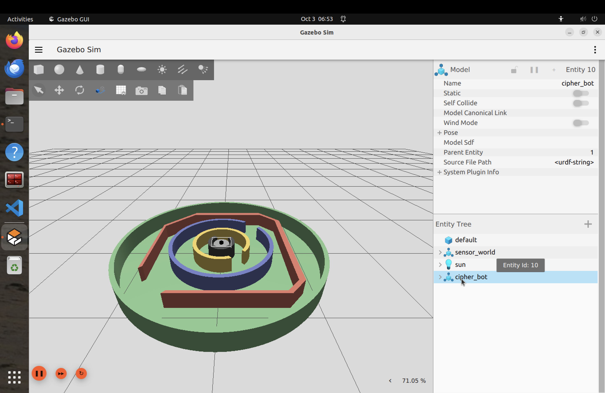

<h1 align="center">Hi, I'm Dhruvi 🤖</h1>

  Robotics & Simulation Enthusiast | B.Tech, Automation & Robotics 
  Team CIPHER (Programming) · Pune, Maharashtra, India

  

---

## ⚙️ Tech Stack

### 🤖 Robotics

### 💻 Languages

### 🛠️ Tools

---

## 🔧 Featured Project

### ROS2 + Gazebo Teleop Implementation
ROS2 workspace with Gazebo simulation and teleop control for a custom robot, built and tested on ROS2 Humble (Linux).

`ROS2` → `Gazebo` → `Teleop` → `Simulation`

Repository: https://github.com/dmittal17/ros2-gazebo-teleop-implementation

---

## 🤖 Active Project

### Team CIPHER Tasks
Robot description (URDF/xacro) with lidar, simulated in Gazebo, plus all my tasks from the CIPHER robotics club.

`CAD` → `URDF/XACRO` → `Gazebo` → `ROS2` → `SLAM` → `Nav2` → `Autonomy`

Repository: https://github.com/dmittal17/Cipher-Tasks

---

## 📂 More Projects
- 🔋 [battery-monitor-ros2](https://github.com/dmittal17/battery-monitor-ros2): ROS2 action server and client simulating robot battery charging
- 🧩 [battery-monitor-interfaces-ros2](https://github.com/dmittal17/battery-monitor-interfaces-ros2): custom ROS2 action interface (Charge.action)
- 🎯 [colour-tracker-ros2](https://github.com/dmittal17/colour-tracker-ros2): OpenCV colour tracking node for ROS2
- 🙂 [face-detection-opencv](https://github.com/dmittal17/face-detection-opencv): real-time face detection with Python and OpenCV
- 🔐 [file-encryption-decryption-tool](https://github.com/dmittal17/file-encryption-decryption-tool): XOR byte-level file encryption in C
- 🧠 [leetcode-everyday-solutions](https://github.com/dmittal17/leetcode-everyday-solutions): daily LeetCode practice in C

---

## 📫 Connect

